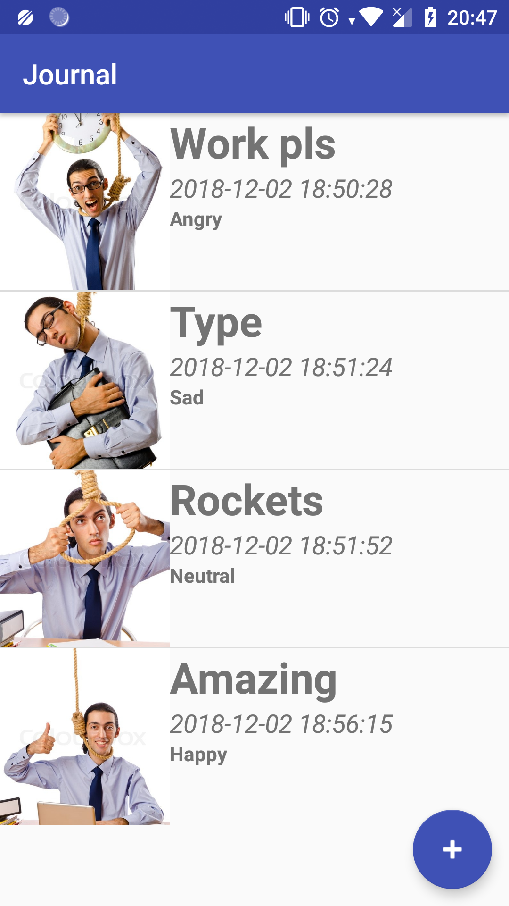
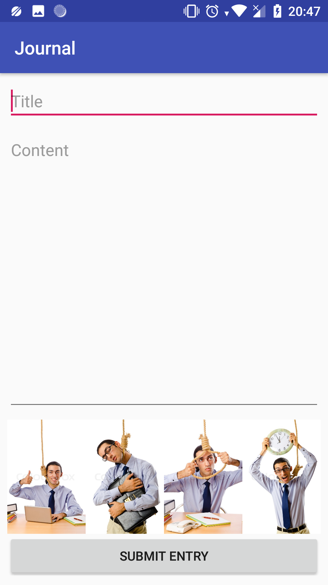
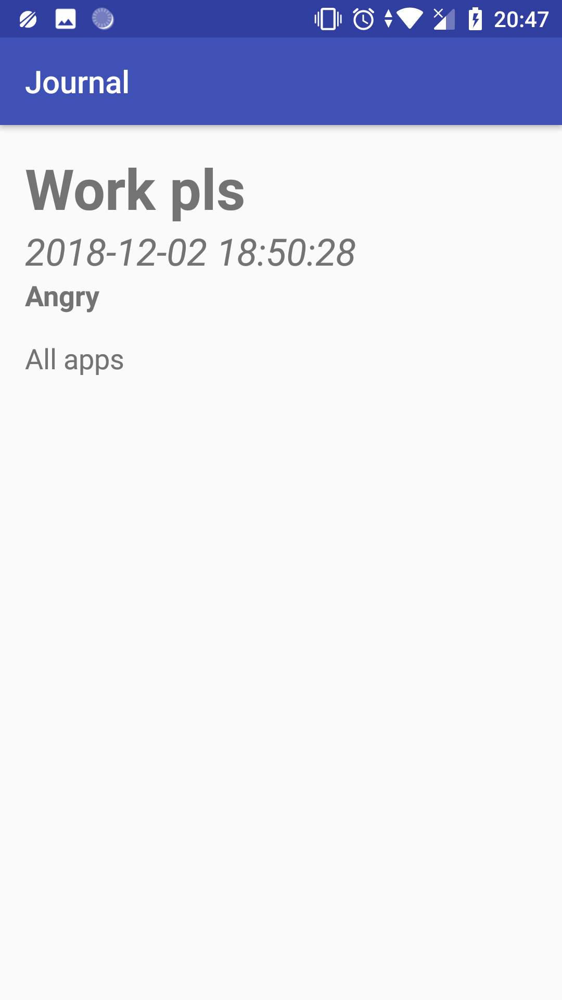
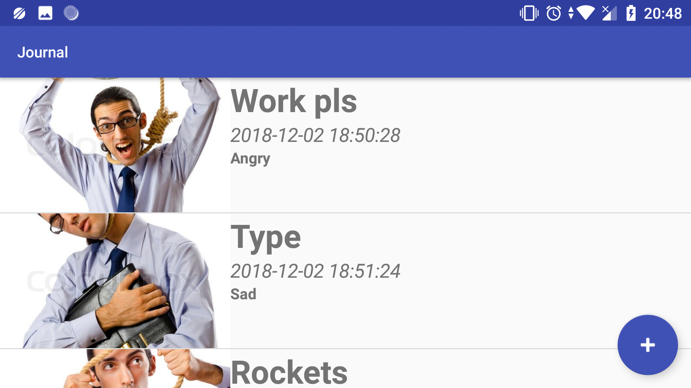

# Journal

## Author info
**Name:** Stefan Klut  
**Studentnumber:** 11331720  
**email:** stefanklut12@gmail.com

## Description
Keep a journal! In this app you can add entries to a journal and also delete or view them.
On the main screen all entries are displayed and there is a button for adding new entries.
By pressing this button you open an new activity where the are some text fields you can fill in.
There is also a radio button where you can select the mood you are feeling. 
Try not to make an mistake when creating an entry, because there is no edit button yet.
By clicking on an entry on the main screen you open the entry to view extra information about the entry.
By clicking and holding an entry on the main screen you delete the entry.

## Screenshots

### Opening Screen:

### Input entry screen:

### Displayed entry:

### Landscape mode:

